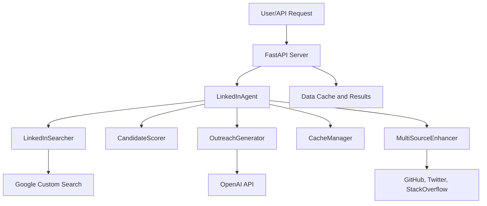

# Synapse AI: LinkedIn Candidate Sourcing Agent

## Overview

This project is an AI-powered LinkedIn candidate sourcing, scoring, and outreach generation tool. It uses Google Custom Search, OpenAI, and optional multi-source data (GitHub, Twitter, etc.) to find and rank candidates for a given job description.

## Brief Write-up

### Approach

This project is designed as a modular, API-driven system for AI-powered LinkedIn candidate sourcing. The core approach is to:

- Accept a job description via API or CLI.
- Use Google Custom Search to find relevant LinkedIn profiles.
- Optionally enhance candidate data with multi-source enrichment (GitHub, Twitter, Stack Overflow, personal websites).
- Score candidates using a configurable rubric (education, experience, company, skills, etc.).
- Generate personalized outreach messages using OpenAI (or fallback templates if OpenAI is unavailable).
- Return structured results via API, CLI, or batch processing.

The architecture is built around FastAPI for serving requests, with a central agent class orchestrating the search, scoring, enrichment, and outreach steps. Each enhancement source (GitHub, Twitter, etc.) is modular, making it easy to add or disable features.

### Challenges Faced

- **API Key Access:** Free access to Twitter and OpenAI APIs is no longer available, which limits real-time enrichment and AI-powered outreach for users without paid keys. The system falls back to simulated or template-based data/messages when keys are missing.
- **Rate Limiting & Reliability:** Google Custom Search and other APIs have strict rate limits and quotas, requiring careful error handling, caching, and retry logic.
- **Candidate Data Quality:** Many guessed personal websites or social profiles do not exist, leading to connection errors or empty enrichments. The system is designed to handle these gracefully and continue processing.
- **Deployment Constraints:** Running on platforms like Hugging Face Spaces or Docker requires careful environment variable management and port configuration.

### Scaling to 100s of Jobs

To scale this system for processing hundreds of jobs efficiently:

- **Batch Processing:** The API and CLI support batch endpoints and scripts, allowing multiple jobs to be processed in parallel.
- **Async & Parallelism:** Use Python's asyncio and concurrent features to parallelize candidate search, enrichment, and scoring across jobs and candidates, reducing total processing time.
- **Caching:** Implement smart caching of search results and candidate enrichments to avoid redundant API calls and speed up repeated queries.
- **Queueing & Workers:** For very large workloads, integrate a task queue (e.g., Celery, RQ) and background workers to distribute jobs across multiple processes or machines.
- **API Rate Management:** Monitor and respect API rate limits, using exponential backoff and quota tracking to avoid failures.
- **Resource Scaling:** Deploy the system on scalable infrastructure (cloud VMs, containers, or serverless) to dynamically allocate resources based on job volume.

This modular, API-first design ensures the system can be extended, parallelized, and deployed at scale for real-world recruiting needs.

---

## 🗂️ Project Structure



---

## 🚀 Setup Instructions

### 1. Clone the Repository

```bash
git clone <your-repo-url>
cd synapse_AI
```

### 2. Install Python Dependencies

```bash
pip install -r requirements.txt
```

### 3. Set Up Environment Variables

Create a `.env` file in the project root with the following keys:

```env
GOOGLE_API_KEY=your_google_api_key
GOOGLE_CSE_ID=your_google_cse_id
OPENAI_API_KEY=sk-...              # Optional, for AI-powered outreach
GITHUB_TOKEN=ghp_...               # Optional, for GitHub enhancement
TWITTER_BEARER_TOKEN=...           # Optional, for Twitter enhancement
ENABLE_TWITTER_API=false           # Set to true to enable Twitter enrichment
```

Get Google API keys from: https://console.developers.google.com/

Get OpenAI API keys from: https://platform.openai.com/account/api-keys

### 4. Test Your Environment

```bash
python setup_env.py
```

This script checks your API keys and reports any missing or invalid ones.

---

## ▶️ Running the Application

### 1. Start the API Server

```bash
python main.py
```

The server runs at: http://0.0.0.0:8000

If you see Agent not ready, recheck your .env file and restart the server.

### 2. Run the Demo Script

```bash
python demo_my_job.py
```

Follow prompts to enter a job description and view candidate results.

### 3. Run the Test Suite

```bash
python test_api_simple.py
python test_api_comprehensive.py
```

Or, using PowerShell:

```powershell
./test_api_powershell.ps1
```

---

## 🧩 Troubleshooting

- **Agent not ready:** Ensure your .env contains valid API keys. Restart the server afterward.
- **Port already in use:** Free up port 8000 or kill conflicting Python processes.
- **OpenAI API errors:** For `invalid_api_key`, double-check your OpenAI key or leave it blank to use fallback messaging.
- **Website/connection errors:** Some candidates may not have valid websites. These warnings are normal.

---

## 💡 Features

- LinkedIn candidate discovery using Google Custom Search API
- Multi-source enhancement (GitHub, Twitter, Stack Overflow, etc.)
- AI-powered personalized LinkedIn outreach generation
- Smart candidate scoring and ranking
- Batch job processing and caching

---

## 📋 API Endpoints

- **GET /**: Root endpoint that returns API metadata
- **GET /health**: Health check endpoint
- **POST /candidates**: Retrieves top candidates for a given job description
  - Input:
    ```json
    {
      "job_description": "string",
      "max_candidates": 10
    }
    ```
  - Output: Returns a JSON list of top candidates, scores, and AI-generated outreach messages.
- **POST /batch**: Processes multiple job descriptions in a single request
  - Input: Array of job descriptions
  - Output: Array of processed results
- **GET /stats**: Returns system usage and performance statistics

---

## 🧪 Usage Example (CLI)

```bash
curl -X POST "https://your-space.hf.space/candidates" \
  -H "Content-Type: application/json" \
  -d '{
    "job_description": "Senior Software Engineer with React and Python experience",
    "max_candidates": 10
  }'
```

---

## 📊 Sample Response Format

```json
{
  "job_description": "Senior Software Engineer...",
  "timestamp": "2024-01-01T12:00:00",
  "total_candidates_found": 25,
  "top_candidates": [
    {
      "name": "John Doe",
      "linkedin_url": "https://linkedin.com/in/johndoe",
      "headline": "Senior Software Engineer at Tech Corp",
      "fit_score": 8.5,
      "score_breakdown": {
        "education": 8.0,
        "trajectory": 9.0,
        "company": 8.5,
        "skills": 9.5,
        "location": 10.0,
        "tenure": 7.0
      },
      "outreach_message": "Hi John, I noticed your impressive React experience...",
      "key_characteristics": {
        "school": "MIT",
        "years_experience": 7
      },
      "job_matches": {
        "location_match": true,
        "skills_match": true
      }
    }
  ],
  "processing_time": 2.5
}
```

---

## ⚙️ Technical Details

- **Framework:** FastAPI
- **Language:** Python 3.9+
- **Deployment:** Hugging Face Spaces (Docker container)
- **Default Port:** 7860

---

## 🔐 Environment Variables (Hugging Face)

Add these in your Hugging Face Space → "Settings" → "Secrets":

```env
GOOGLE_API_KEY=your_key
GOOGLE_CSE_ID=your_cse_id
OPENAI_API_KEY=your_openai_key  # Optional
```

---

## 🪪 License

This project is licensed under the MIT License.
See the LICENSE file for full details.

Built with ❤️ for AI-powered recruiting
